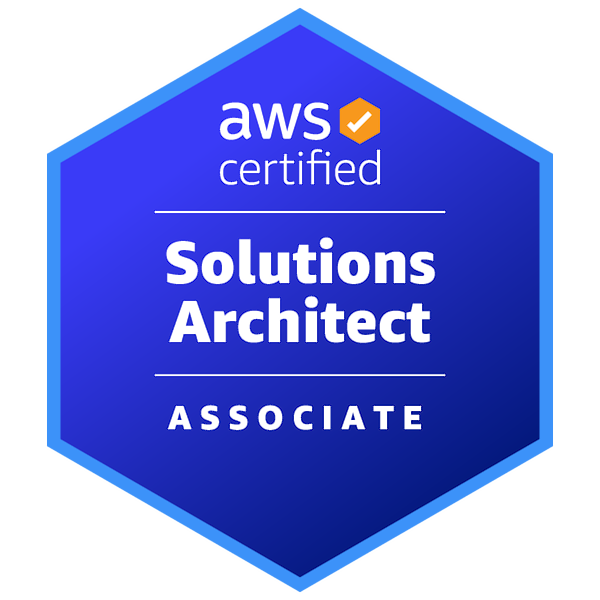
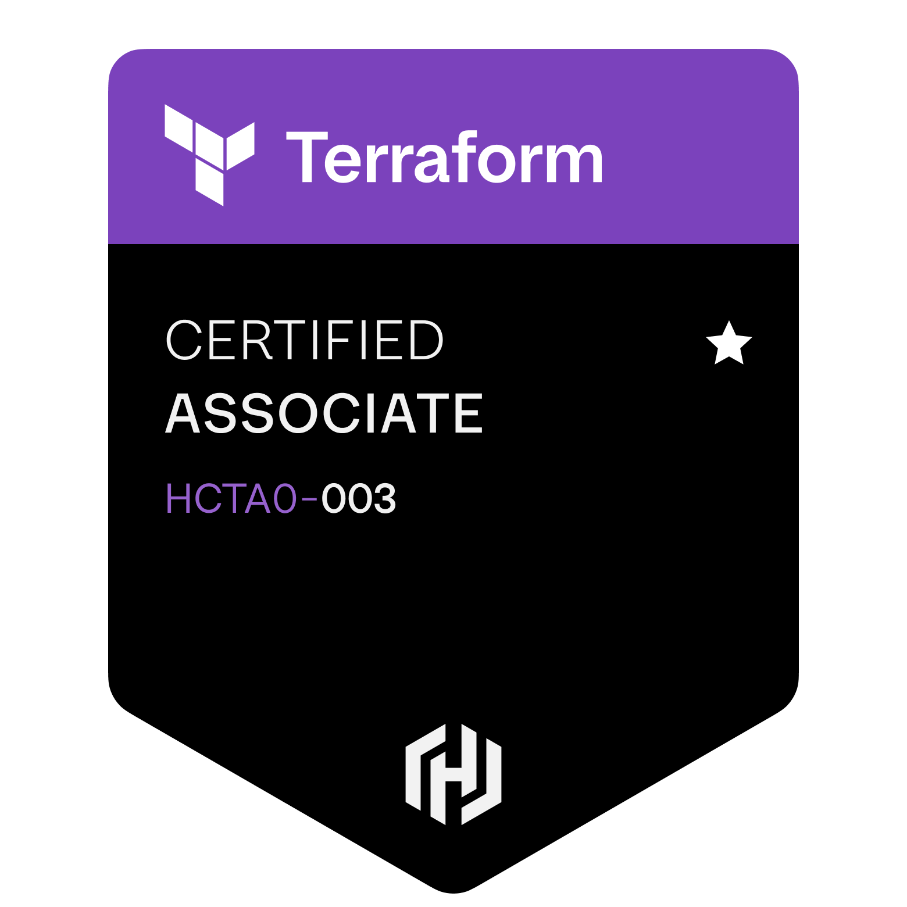
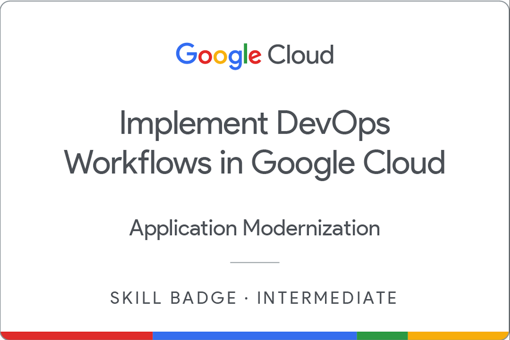
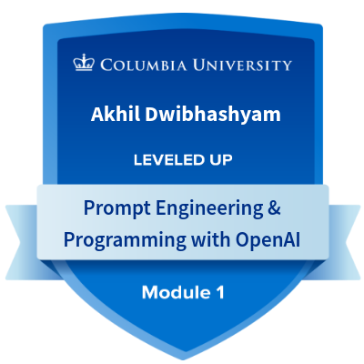
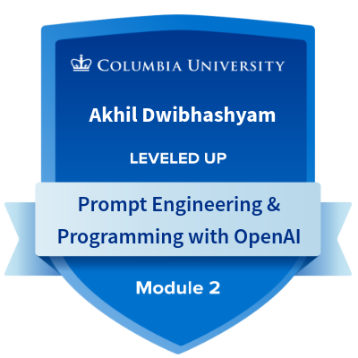

  

  
  
  
  

---

## About Me

I'm a **Software DevOps Engineer** with **5+ years** of progressive experience in **IT Infrastructure** and **Cloud Technologies**, holding a Master's degree in **Computer Science**. My journey evolved from **Software Systems Engineer** to **Cloud Technologies** and **DevOps**, now focusing on **AI integration** and **intelligent analytics platforms**.

Currently working at **Findica** as a **Software DevOps Engineer – AI**, I focus on building and maintaining enterprise AI analytics platforms, implementing semantic caching and intelligent query templating to optimize AI API integrations and system performance.

### What I Bring to the Table

- **AI Expertise**: Experience with LLMs, GenAI, and AI-powered analytics platforms
- **Infrastructure Excellence**: Proven track record in cloud computing, containers, and system administration
- **Security-First Approach**: Strong focus on security, compliance, and data protection
- **Scalability**: Experience designing and maintaining highly scalable infrastructure
- **Stakeholder Collaboration**: Proven track record working with multiple stakeholders in critical environments

---

## Certifications & Achievements

  
  
  
  
  
  

---

## Tech Stack

### AI & Machine Learning
   

### Cloud & Infrastructure
  

### IaC & Automation
 

### Containers & Orchestration
  

### CI/CD
 

### Monitoring & Observability
  

### Programming & Development
    

### Scripting & Automation
 

### Databases & Storage
  

### Security & Compliance
   

### Networking
  

---

## Career Focus

I'm actively seeking roles as **AI Engineer**, **Cloud Engineer**, **DevOps Engineer**, and **Site Reliability Engineer (SRE)**:

| Role | Focus Areas |
|------|-------------|
| **AI Engineer** | LLMs, GenAI, AI-powered analytics, ML pipelines |
| **Cloud Engineer** | AWS/Azure/GCP, infrastructure automation, cloud architecture |
| **DevOps Engineer** | CI/CD, containerization, automation, Infrastructure as Code |
| **Site Reliability Engineer (SRE)** | Monitoring, observability, reliability, incident response |

**Open to both full-time and contracting opportunities** with 5+ years of experience and a Master's degree in Computer Science.

---

## Featured Projects

### AI-Powered Analytics Platform
*Enterprise level intelligent analytics platform*

    

**Key Achievements:**
- **60% cost reduction** for AI API integrations through semantic caching
- **99.9% uptime** with comprehensive error handling and monitoring
- Interactive network visualization and Natural language query processing

**Core Features:**
- **AI Integration**: LLM-powered natural language queries
- **Data Visualization**: Interactive network graphs with D3.js and Recharts
- **Real-time Analytics**: Live PostgreSQL connections with comprehensive KPIs
- **Performance Optimization**: Token usage tracking and rate limiting
- **Security**: SQL injection prevention and secure API handling

### Application Migration to AWS
*Enterprise-scale application containerization and CI/CD implementation*

  

**Achievements:**
- Migrated multi-module application to AWS
- Implemented containerization with Docker & Kubernetes
- Automated CI/CD pipelines for streamlined deployment
- Enhanced deployment reliability and consistency

### Canadian Retail Cloud Storage Migration
*Large-scale storage infrastructure migration to AWS*

 

**Achievements:**
- Migrated Hitachi HUSVM and HNAS on-premise storage to AWS
- Achieved **99.9% uptime** during migration
- Enhanced data integrity and availability
- Reduced operational costs while improving performance

### Backup Infrastructure Migration to Azure
*End-to-end backup system migration and optimization*

 

**Achievements:**
- Migration of backup systems from IBM TSM to Dell Avamar on Azure Cloud
- Developed comprehensive HA/DR plans and optimized backup schedules
- **Reduced operational disruptions by 50%**
- Improved cost efficiency and backup reliability

### Marketing Website with Next.js
*Responsive marketing website with modern performance optimizations*

  

**Achievements:**
- Developed and deployed responsive marketing website using TypeScript and Next.js
- Implemented server-side rendering and image optimization for enhanced performance
- Deployed on Vercel with SEO best practices achieving **40% faster load times**
- Enhanced developer productivity with modern development tools and practices

---

## Technical Writing

I share my knowledge and experiences through technical writing on Medium. Here are some of my recent articles:

### Recent Articles

- **[How to Run Open-Source LLMs Locally with Ollama — The Fastest Way to Start](https://medium.com/@adwibha/how-to-run-open-source-llms-locally-with-ollama-the-fastest-way-to-start-97b9b2f6986d)**
- **[You commit code. Jenkins builds, tests, and deploys it — automatically, reliably, and repeatably](https://medium.com/@adwibha/you-commit-code-jenkins-builds-tests-and-deploys-it-automatically-reliably-and-repeatably-bcb43f9f9123)**
- **[Your Systems Are Talking. Splunk Helps You Understand What They're Saying](https://medium.com/@adwibha/your-systems-are-talking-splunk-helps-you-understand-what-theyre-saying-a5876ec1b462)**
- **[Infrastructure as Code (IaC) with Terraform on AWS — The What, Why & How](https://medium.com/@adwibha/infrastructure-as-code-iac-with-terraform-on-aws-the-what-why-how-800a99ad24ba)**
- **[Monitoring AWS EKS with Prometheus and Grafana](https://medium.com/@adwibha/monitoring-aws-eks-with-prometheus-and-grafana-1b9d92f63a22)**
- **[What is SaaS, PaaS, and IaaS?](https://medium.com/@adwibha/what-is-saas-paas-and-iaas-e800af9159a3)**

---

## Let's Connect

**I'm always open to discussing AI, DevOps, infrastructure, or new opportunities!**

---

*Thanks for visiting my profile! Feel free to reach out for collaborations or opportunities.*

---
