<div align="center">
<table>
  <tr>
    <td width="50%" valign="middle" align="left">
      <h2>👋 Hello, I am Akhil</h2>
      <p></p>
      <p>
        <a href="https://www.linkedin.com/in/akhil-dwibhashyam/"></a>
        &nbsp;
        <a href="https://medium.com/@adwibha"></a>
        &nbsp;
        
      </p>
    </td>
    <td width="50%" valign="middle" align="right">
      
    </td>
  </tr>
</table>
</div>

---

<div align="left">

```yaml
adwibha@MacBook:~
$ whoami
name       : Akhil Dwibhashyam
location   : Austin, TX · Open to remote
stack      : AWS · Terraform · Kubernetes · Python · FastAPI · LangChain
focus:
  backend         : REST APIs, FastAPI/Node, service design, databases
  infrastructure  : IaC, ECS/EKS, CI/CD, zero-downtime deployments
  reliability     : SLIs/SLOs, observability, incident response automation
  ai-systems      : RAG pipelines, LLM cost routing, MCP, vector search
  mcp-servers     : MCP server development for agent integration
certifications:
  - AWS Solutions Architect – Associate
  - HashiCorp Certified Terraform Associate
  - Certified DevOps Engineer (CDE)
  - Prompt Engineering & Programming with OpenAI (Columbia)
education  : Master of Science in Computer Science
currently  : Open to Software Engineering · DevOps · SRE · AI Infrastructure roles
```

</div>

---

<div align="center">

## About Me

</div>

I'm a **Software DevOps Engineer** with **5+ years** of experience in **backend development**, **REST APIs**, **IT Infrastructure**, and **Cloud Technologies**, along with a Master's degree in **Computer Science**. I build and ship backend services and APIs, and my journey has evolved from **Software Systems Engineer** to **Cloud** and **DevOps**, with a strong focus on **AI integration** and **Intelligent analytics platforms**.

Currently at **Findica** as a **Software DevOps Engineer – AI**, I design and maintain enterprise AI analytics platform, **REST APIs**, semantic caching, and intelligent query templating to optimize AI integrations and system performance. I ship backend and AI systems that run in production — and I care as much about observability and reliability as I do about shipping.

---

<div align="center">
<table>
  <tr>
    <td width="50%" valign="top">
      <h3>Philosophy</h3>
      <blockquote>"Improvement at anything is based on thousands of tiny failures, and the magnitude of your success is based on how many times you've failed at something". <i> - Mark Manson </i></blockquote>
    </td>
    <td width="50%" valign="top">
      <h3>Certifications</h3>
      <div align="center">
        <a href="https://www.credly.com/badges/f56e733e-3127-45fd-ac30-aa9e55cc2162/public_url">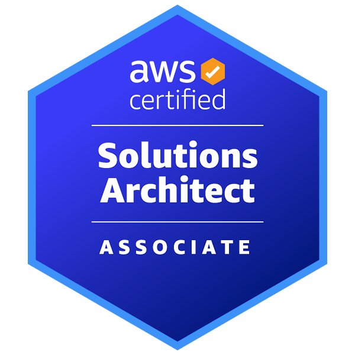</a>
        <a href="https://www.credly.com/badges/845b2cb1-dc4d-41fb-b0e0-705b37bf7bc4/public_url">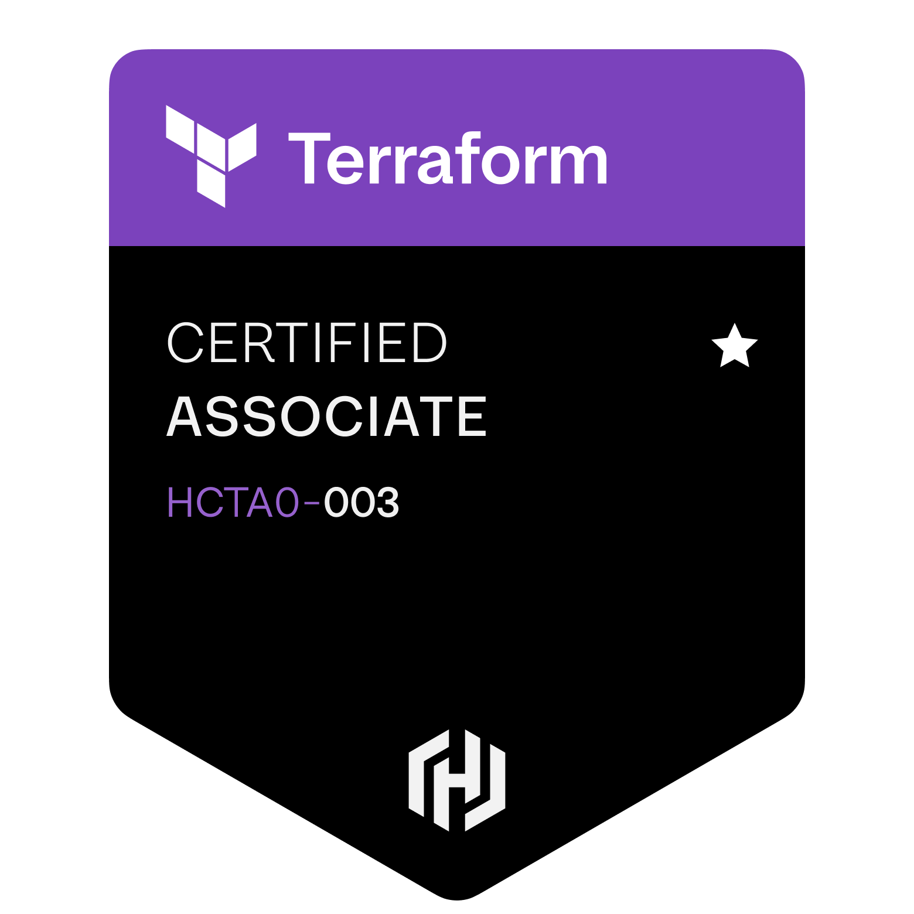</a>
        <a href="https://www.gsdcouncil.org/certificate-verification">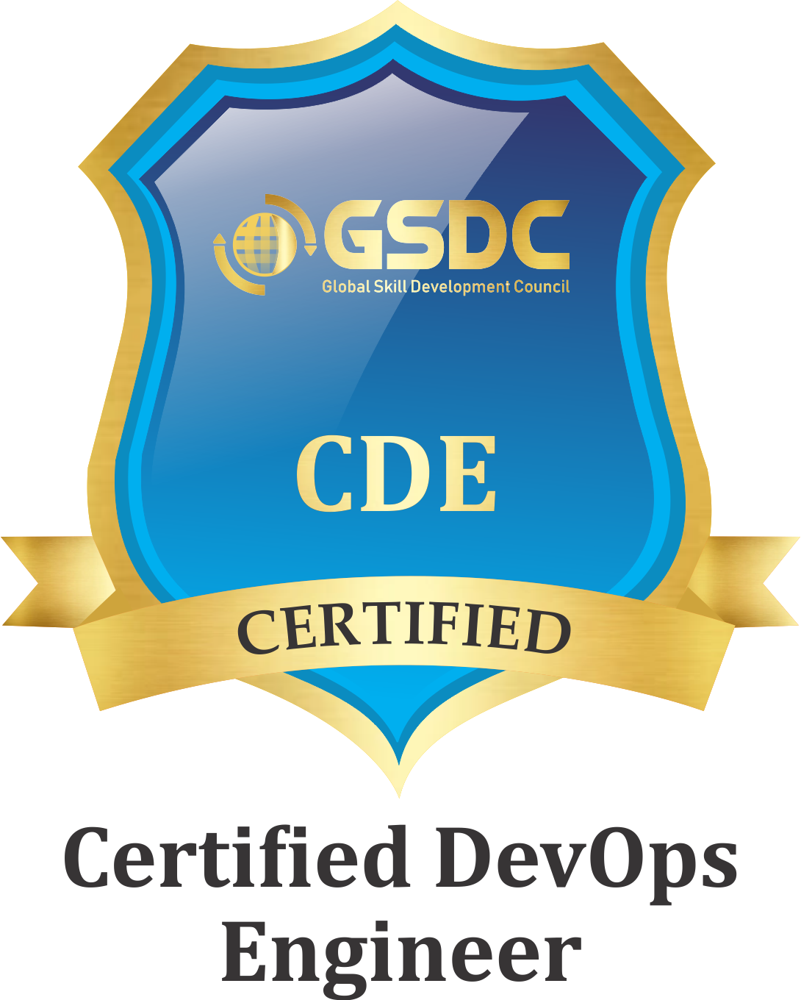</a>
      </div>
    </td>
  </tr>
</table>
</div>

---

<div align="center">

## What I Build

<table>
  <tr>
    <td align="center" width="33%">
      <p> 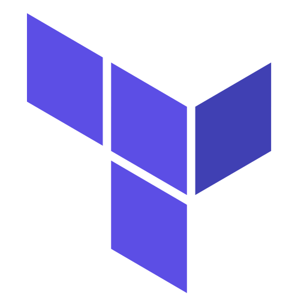 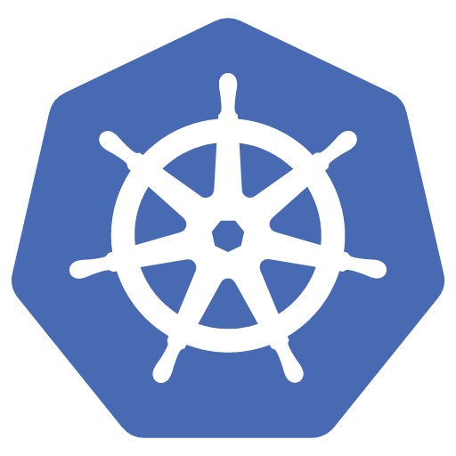</p>
      <p><strong>Cloud Infrastructure</strong></p>
      <p>Production AWS platforms. ECS/EKS, Terraform IaC, VPC design, zero-downtime CI/CD. Systems that scale without manual intervention.</p>
    </td>
    <td align="center" width="33%">
      <p> 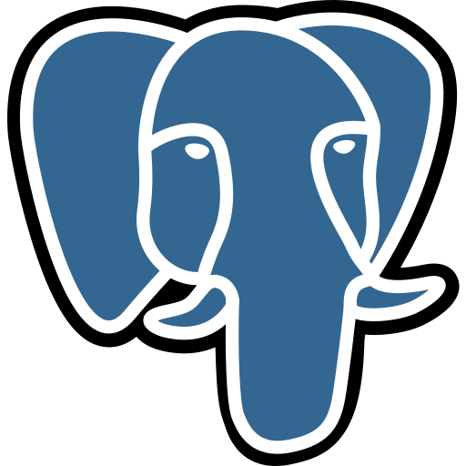</p>
      <p><strong>Backend & AI Systems</strong></p>
      <p>REST APIs (FastAPI, Node), RAG pipelines, LLM cost routers, MCP servers, streaming APIs. Backend services and AI that run reliably under load — not just demos.</p>
    </td>
    <td align="center" width="33%">
      <p> </p>
      <p><strong>Reliability Engineering</strong></p>
      <p>Observability stacks, SLI/SLO frameworks, automated incident response. When things break, the system responds before you wake up.</p>
    </td>
  </tr>
</table>

</div>

---

<div align="center">

## Tech Stack

<table cellpadding="12" cellspacing="0">
  <tr>
    <td width="50%" valign="top" align="center">
      <p><strong>AI & Machine Learning</strong><br/> 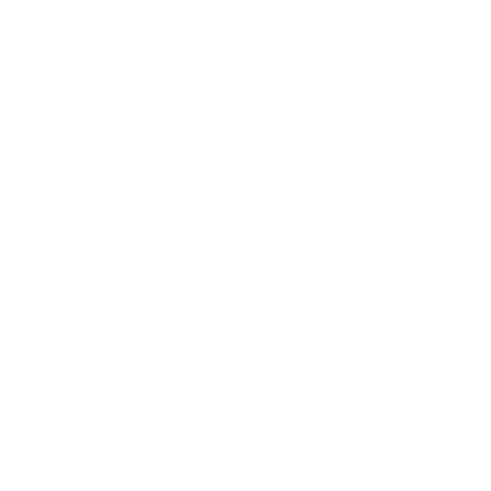</p>
      <p><strong>Cloud & Infrastructure</strong><br/>  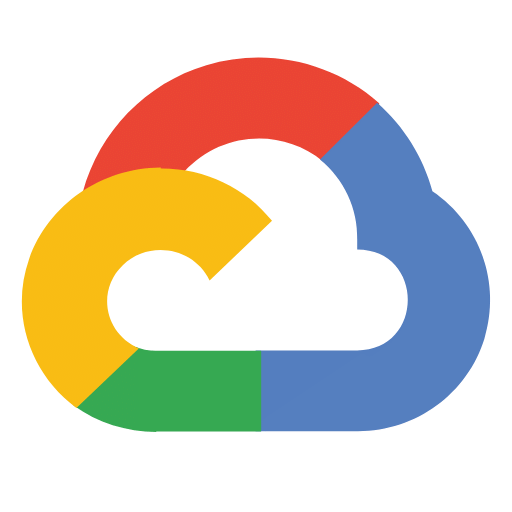</p>
      <p><strong>IaC & Automation</strong><br/> </p>
      <p><strong>Containers & Orchestration</strong><br/>  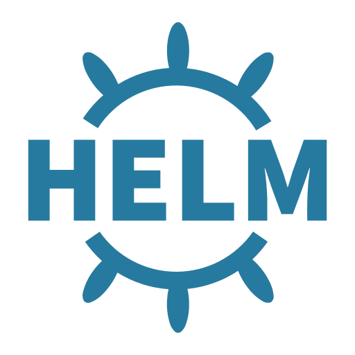</p>
      <p><strong>CI/CD</strong><br/>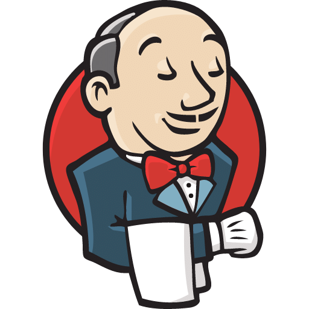 </p>
      <p><strong>Monitoring & Observability</strong><br/> 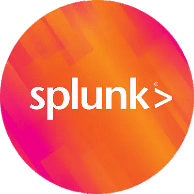</p>
    </td>
    <td width="50%" valign="top" align="center">
      <p><strong>Backend & APIs</strong><br/>  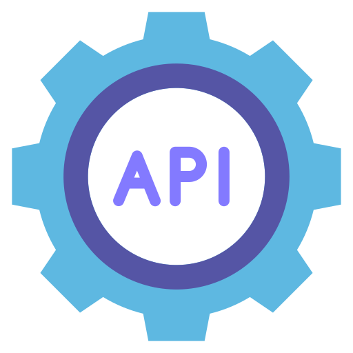</p>
      <p><strong>Programming & Development</strong><br/></p>
      <p><strong>Scripting & Automation</strong><br/></p>
      <p><strong>Databases & Storage</strong><br/> </p>
      <p><strong>Security & Networking</strong><br/> 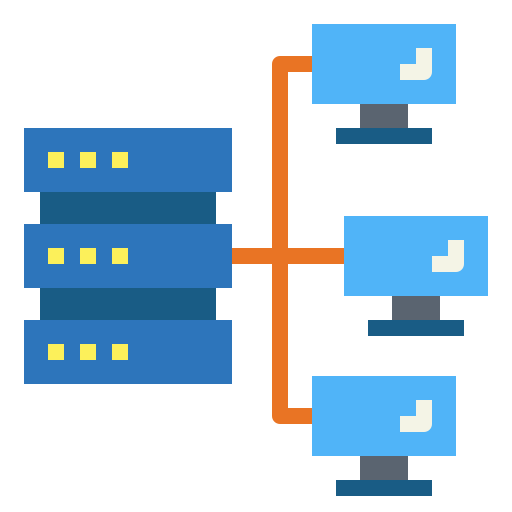 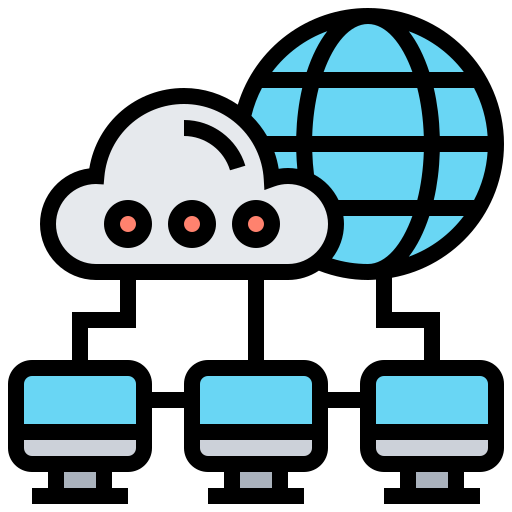 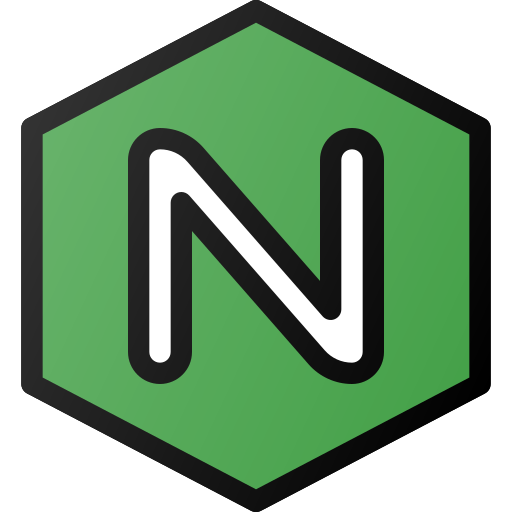</p>
    </td>
  </tr>
</table>

</div>

---

<div align="center">

## Featured Projects

<table cellpadding="12">
  <tr>
    <td width="50%" valign="top">
      <h3>AI-Powered Analytics Platform</h3>
      <p><em>Enterprise level intelligent analytics platform</em></p>
      <p> </p>
      <p><strong>Key:</strong> 60% cost reduction (semantic caching), 99.9% uptime. LLM natural language queries, D3.js/Recharts visualization, real-time PostgreSQL KPIs, token tracking &amp; rate limiting.</p>
    </td>
    <td width="50%" valign="top">
      <h3>Application Migration to AWS</h3>
      <p><em>Enterprise-scale containerization and CI/CD</em></p>
      <p>  </p>
      <p>Migrated multi-module app to AWS. Docker &amp; Kubernetes containerization, automated CI/CD pipelines, improved deployment reliability.</p>
    </td>
  </tr>
  <tr>
    <td width="50%" valign="top">
      <h3>Canadian Retail Cloud Storage Migration</h3>
      <p><em>Large-scale storage infrastructure migration to AWS</em></p>
      <p> </p>
      <p>Hitachi HUSVM/HNAS on-prem to AWS. 99.9% uptime during migration, enhanced data integrity, reduced cost.</p>
    </td>
    <td width="50%" valign="top">
      <h3>Backup Infrastructure Migration to Azure</h3>
      <p><em>End-to-end backup system migration and optimization</em></p>
      <p> 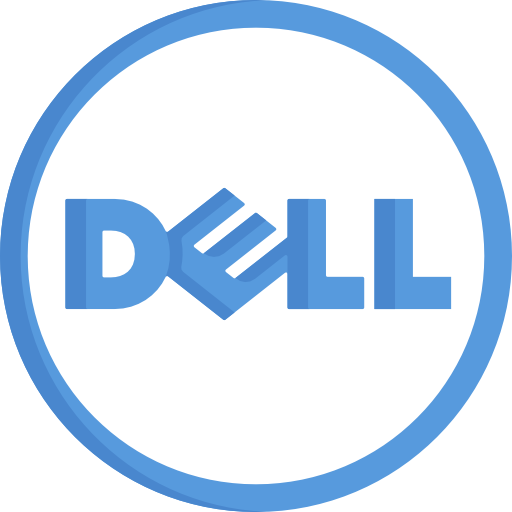</p>
      <p>IBM TSM → Dell Avamar on Azure. HA/DR plans, optimized backup schedules, 50% fewer operational disruptions.</p>
    </td>
  </tr>
  <tr>
    <td colspan="2" valign="top">
      <h3>Marketing Website with Next.js</h3>
      <p><em>Responsive marketing site with modern performance optimizations</em></p>
      <p></p>
      <p>TypeScript &amp; Next.js, server-side rendering, image optimization. Deployed on Vercel, 40% faster load times, SEO best practices.</p>
    </td>
  </tr>
</table>

### Open Source & Side Projects

*Production systems. Real metrics. No demo-ware.*

<table cellpadding="12">
  <tr>
    <td width="50%" valign="top">
      <h3><a href="https://github.com/adwibha/rag-pipeline">rag-pipeline</a></h3>
      <p><em>Document ingestion → pgvector semantic search → Ollama LLM → streamed answers</em></p>
      <p> </p>
      <p>Redis cache cuts repeated query latency to &lt;5ms. MCP server exposes RAG as a tool for AI agents.</p>
    </td>
    <td width="50%" valign="top">
      <h3><a href="https://github.com/adwibha/obs-stack-local">obs-stack-local</a></h3>
      <p><em>6-service observability stack — pre-provisioned dashboards, alert rules, one command</em></p>
      <p> </p>
      <p>SLI/SLO-driven alerting · 40% faster incident detection</p>
    </td>
  </tr>
  <tr>
    <td width="50%" valign="top">
      <h3><a href="https://github.com/adwibha/ai-incident-responder">ai-incident-responder</a></h3>
      <p><em>Alert fires → Prometheus enrichment → LLM runbook → React dashboard in seconds</em></p>
      <p> </p>
      <p>Webhook to stored LLM runbook in under 15s · Ollama + Perplexity support</p>
    </td>
    <td width="50%" valign="top">
      <h3><a href="https://github.com/adwibha/llm-router">llm-router</a></h3>
      <p><em>Routes prompts to cheapest Perplexity model. Tracks every token, dollar, and latency.</em></p>
      <p> </p>
      <p>Full cost telemetry per request · OpenAI-compatible API · provider-agnostic</p>
    </td>
  </tr>
</table>

</div>

---

<div align="center">

## GitHub Activity

  <picture>
    <source media="(prefers-color-scheme: dark)" srcset="https://github-readme-stats.vercel.app/api?username=adwibha&show_icons=true&theme=tokyonight&hide_border=true&count_private=true&include_all_commits=true">
    <source media="(prefers-color-scheme: light)" srcset="https://github-readme-stats.vercel.app/api?username=adwibha&show_icons=true&theme=default&hide_border=true&count_private=true&include_all_commits=true">
    
  </picture>
  <picture>
    <source media="(prefers-color-scheme: dark)" srcset="https://github-readme-stats.vercel.app/api/top-langs/?username=adwibha&layout=compact&theme=tokyonight&hide_border=true&langs_count=8&count_private=true&include_all_commits=true">
    <source media="(prefers-color-scheme: light)" srcset="https://github-readme-stats.vercel.app/api/top-langs/?username=adwibha&layout=compact&theme=default&hide_border=true&langs_count=8&count_private=true&include_all_commits=true">
    
  </picture>

</div>

---

<div align="center">

## Contribution Graph

  <picture>
    <source media="(prefers-color-scheme: dark)" srcset="https://raw.githubusercontent.com/adwibha/adwibha/output/github-contribution-grid-snake-dark.svg">
    <source media="(prefers-color-scheme: light)" srcset="https://raw.githubusercontent.com/adwibha/adwibha/output/github-contribution-grid-snake.svg">
    
  </picture>

</div>

---

<div align="center">

## Technical Writing

I share my knowledge and experiences through technical writing on Medium.

<a href="https://medium.com/@adwibha"></a>

</div>

### Recent Articles

- **[How to Run Open-Source LLMs Locally with Ollama — The Fastest Way to Start](https://medium.com/@adwibha/how-to-run-open-source-llms-locally-with-ollama-the-fastest-way-to-start-97b9b2f6986d)**
- **[Monitoring AWS EKS with Prometheus and Grafana](https://medium.com/@adwibha/monitoring-aws-eks-with-prometheus-and-grafana-1b9d92f63a22)**
- **[Infrastructure as Code (IaC) with Terraform on AWS — The What, Why & How](https://medium.com/@adwibha/infrastructure-as-code-iac-with-terraform-on-aws-the-what-why-how-800a99ad24ba)**

---

<div align="center">

## Let's Connect

**I'm always open to discussing AI, DevOps, infrastructure, or new opportunities!**

<a href="https://www.linkedin.com/in/akhil-dwibhashyam/"></a>

</div>

---

<p align="center">
  Flaticon credits:
  <a href="https://www.flaticon.com/free-icons/security" title="security icons">Security icons created by Freepik - Flaticon</a> ·
  <a href="https://www.flaticon.com/free-icons/api" title="api icons">Api icons created by berkahicon - Flaticon</a> ·
  <a href="https://www.flaticon.com/free-icons/load-balancer" title="load balancer icons">Load balancer icons created by smalllikeart - Flaticon</a> ·
  <a href="https://www.flaticon.com/free-icons/dell" title="dell icons">Dell icons created by Freepik - Flaticon</a> ·
  <a href="https://www.flaticon.com/free-icons/hitachi" title="hitachi icons">Hitachi icons created by Freepik - Flaticon</a>
</p>
