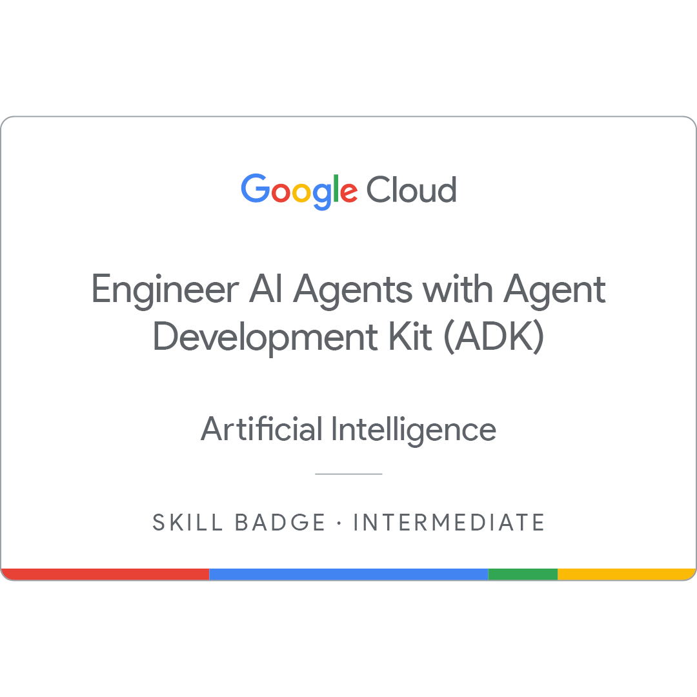

<div align="center">
<table>
  <tr>
    <td width="50%" valign="middle" align="left">
      <h2>👋 Hello, I am Akhil</h2>
      <p></p>
      <p>
        <a href="https://www.linkedin.com/in/akhil-dwibhashyam/"></a>
        &nbsp;
        <a href="https://medium.com/@adwibha"></a>
        &nbsp;
        <a href="https://www.credly.com/users/adwibha"></a>
      </p>
    </td>
    <td width="50%" valign="middle" align="right">
      
    </td>
  </tr>
</table>
</div>

---

<div align="left">

```yaml
adwibha@MacBook:~
$ whoami
name       : Akhil Dwibhashyam
location   : Austin, TX · Open to remote
stack      : AWS · Terraform · Kubernetes · Python · FastAPI · TypeScript/Node
focus:
  backend         : REST APIs, FastAPI/Node, service design, PostgreSQL
  infrastructure  : IaC, ECS/EKS, CI/CD, zero-downtime deployments
  reliability     : SLIs/SLOs, observability, incident response automation
  ai-systems      : Multi-agent systems, LLM cost optimization, MCP servers, agentic workflows
certifications:
  - AWS Solutions Architect – Associate
  - HashiCorp Certified Terraform Associate
  - Certified DevOps Engineer (CDE)
  - McKinsey Forward Program
  - Engineer AI Agents with Agent Development Kit (ADK)
education  : Master of Science in Computer Science
currently  : Software Engineering · DevOps · SRE · AI Infrastructure roles
```

</div>

---

<div align="center">

## About Me

</div>

5+ years building backend services, cloud infrastructure (AWS, Azure, GCP), and DevOps pipelines. MS in Computer Science.

Increasingly focused on production agentic AI: multi-agent orchestration with LangGraph, LLM cost optimization, and observable autonomous systems. Recent work spans production research agents, semantic caching (60% LLM cost reduction), and real-time analytics platforms.

Before AI, I ran large-scale cloud migrations and built EKS deployment pipelines. Core intersection: infrastructure reliability meets agentic AI.

---

<div align="center">

## Certifications

<a href="https://www.credly.com/badges/f56e733e-3127-45fd-ac30-aa9e55cc2162/public_url"></a>
&nbsp;&nbsp;
<a href="https://www.credly.com/badges/845b2cb1-dc4d-41fb-b0e0-705b37bf7bc4/public_url"></a>
&nbsp;&nbsp;
<a href="https://www.gsdcouncil.org/certificate-verification"></a>
&nbsp;&nbsp;
<a href="https://www.credly.com/badges/ded808d6-8eb0-4ac6-a0c2-5c6927325650/public_url"></a>
&nbsp;&nbsp;
<a href="https://www.credly.com/badges/a1cf45de-7013-40ec-b9fd-7350a35ca49b/public_url"></a>

</div>

---

<div align="center">

## What I Build

<table>
  <tr>
    <td align="center" width="33%">
      <p>  </p>
      <p><strong>Cloud Infrastructure</strong></p>
      <p>Production AWS environments with Terraform IaC, ECS/EKS orchestration, VPC networking, and automated CI/CD pipelines.</p>
    </td>
    <td align="center" width="33%">
      <p> </p>
      <p><strong>Agentic AI & Backend</strong></p>
      <p>Multi-agent systems with LangGraph orchestration, REST APIs (FastAPI, Node), LLM cost optimization, MCP servers, and streaming architectures.</p>
    </td>
    <td align="center" width="33%">
      <p> </p>
      <p><strong>Reliability & Observability</strong></p>
      <p>Observable agentic systems, SLI/SLO frameworks, incident response automation, and production monitoring stacks (Prometheus, Grafana, Splunk).</p>
    </td>
  </tr>
</table>

</div>

---

<div align="center">

## Tech Stack

<table cellpadding="12" cellspacing="0">
  <tr>
    <td width="50%" valign="top" align="center">
      <p><strong>Languages & Backend</strong><br/> </p>
      <p><strong>Infrastructure</strong><br/>   </p>
    </td>
    <td width="50%" valign="top" align="center">
      <p><strong>AI & Data</strong><br/>  </p>
      <p><strong>Observability</strong><br/> </p>
    </td>
  </tr>
</table>

</div>

---

<div align="center">

## Featured Projects

<table cellpadding="12">
  <tr>
    <td width="50%" valign="top">
      <h3><a href="https://github.com/adwibha/researchflow-agent">Production Multi-Agent Research System</a></h3>
      <p><em>Autonomous agentic system for research synthesis and iterative refinement</em></p>
      <p></p>
      <p>Production-grade multi-agent orchestration with LangGraph. Autonomous research synthesis, iterative refinement, and tool orchestration. Real-time API integration, context management, and agentic workflows at scale.</p>
    </td>
    <td width="50%" valign="top">
      <h3>AI Analytics Platform</h3>
      <p><em>Enterprise analytics with LLM-powered natural language queries</em></p>
      <p> </p>
      <p>Semantic caching reduced LLM API costs by 60%. Real-time PostgreSQL KPIs, D3.js visualization, token tracking, rate limiting. 99.9% uptime.</p>
    </td>
  </tr>
  <tr>
    <td width="50%" valign="top">
      <h3>Application Migration to AWS</h3>
      <p><em>Containerized deployment pipeline for multi-module enterprise application</em></p>
      <p>  </p>
      <p>Containerized multi-service app and migrated to EKS. Built Jenkins CI/CD pipelines with automated rollouts and zero-downtime deployments. Reduced deployment time by 70%.</p>
    </td>
    <td width="50%" valign="top">
      <h3>Retail Storage Migration to AWS</h3>
      <p><em>On-premises to cloud storage migration for a Canadian retailer</em></p>
      <p> </p>
      <p>Migrated Hitachi HUSVM/HNAS storage to AWS. Maintained 99.9% uptime throughout migration with zero data loss. Designed HA/DR architecture and runbooks.</p>
    </td>
  </tr>
</table>

### Open Source

<table cellpadding="12">
  <tr>
    <td width="50%" valign="top">
      <h3><a href="https://github.com/adwibha/exploring-adk">exploring-adk</a></h3>
      <p><em>10-module learning curriculum for Google Agent Development Kit</em></p>
      <p></p>
      <p>Hands-on learning resource. Agent configuration, tool orchestration, multi-agent systems, LangGraph integration, and production patterns.</p>
    </td>
    <td width="50%" valign="top">
      <h3><a href="https://github.com/google/adk-js">google/adk-js</a></h3>
      <p><em>Google Agent Development Kit — TypeScript</em></p>
      <p></p>
      <p>Contributor to official Google ADK. Building agentic capabilities into the TypeScript ecosystem.</p>
    </td>
  </tr>
  <tr>
    <td width="50%" valign="top">
      <h3><a href="https://github.com/adwibha/llm-router">llm-router</a></h3>
      <p><em>LLM cost optimization via intelligent model routing</em></p>
      <p></p>
      <p>Routes prompts to the cheapest capable model. Per-request cost telemetry, OpenAI-compatible API, multi-provider support.</p>
    </td>
    <td width="50%" valign="top">
      <h3><a href="https://github.com/adwibha/obs-stack-local">obs-stack-local</a></h3>
      <p><em>Observability stack for agentic systems</em></p>
      <p></p>
      <p>6-service stack with SLI/SLO alerting. One <code>docker compose up</code> to instrument production systems.</p>
    </td>
  </tr>
  <tr>
    <td width="50%" valign="top">
      <h3><a href="https://github.com/adwibha/rag-pipeline-ollama">rag-pipeline-ollama</a></h3>
      <p><em>Document ingestion → semantic search → local LLM response</em></p>
      <p></p>
      <p>pgvector RAG with Redis caching (5ms latency on repeated queries). Ollama local inference, MCP server integration.</p>
    </td>
    <td width="50%" valign="top">
      <h3><a href="https://github.com/adwibha/rag-agentic-search">rag-agentic-search</a></h3>
      <p><em>Agentic search with iterative query refinement</em></p>
      <p></p>
      <p>Agent-driven RAG. Autonomous query refinement, multi-step search strategies, and relevance feedback loops.</p>
    </td>
  </tr>
</table>

</div>

---

<div align="center">

## Technical Writing

<a href="https://medium.com/@adwibha"></a>

</div>

- **[How to Run Open-Source LLMs Locally with Ollama — The Fastest Way to Start](https://medium.com/@adwibha/how-to-run-open-source-llms-locally-with-ollama-the-fastest-way-to-start-97b9b2f6986d)**
- **[Monitoring AWS EKS with Prometheus and Grafana](https://medium.com/@adwibha/monitoring-aws-eks-with-prometheus-and-grafana-1b9d92f63a22)**
- **[Infrastructure as Code (IaC) with Terraform on AWS — The What, Why & How](https://medium.com/@adwibha/infrastructure-as-code-iac-with-terraform-on-aws-the-what-why-how-800a99ad24ba)**

View all on <a href="https://medium.com/@adwibha">Medium</a>.

---

<div align="center">

## Let's Connect

**Open to Software Engineering, DevOps, SRE, and AI Infrastructure roles.**

<a href="https://www.linkedin.com/in/akhil-dwibhashyam/"></a>
&nbsp;&nbsp;
<a href="https://medium.com/@adwibha"></a>
&nbsp;&nbsp;
<a href="https://github.com/adwibha?tab=repositories"></a>

</div>

