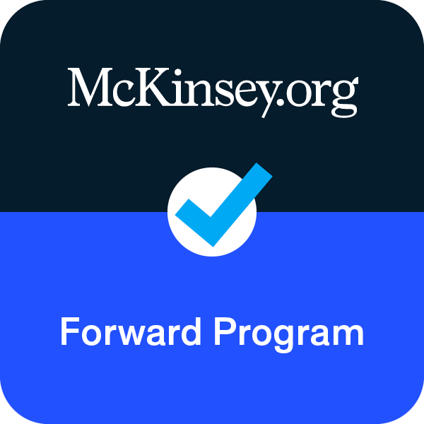

<div align="center">
<table>
  <tr>
    <td width="50%" valign="middle" align="left">
      <h2>👋 Hello, I am Akhil</h2>
      <p></p>
      <p>
        <a href="https://www.linkedin.com/in/akhil-dwibhashyam/"></a>
        &nbsp;
        <a href="https://medium.com/@adwibha"></a>
        &nbsp;
        <a href="https://www.credly.com/users/adwibha"></a>
      </p>
    </td>
    <td width="50%" valign="middle" align="right">
      
    </td>
  </tr>
</table>
</div>

---

<div align="left">

```yaml
adwibha@MacBook:~
$ whoami
name       : Akhil Dwibhashyam
location   : Austin, TX · Open to remote
stack      : AWS · Terraform · Kubernetes · Python · FastAPI · LangChain
focus:
  backend         : REST APIs, FastAPI/Node, service design, databases
  infrastructure  : IaC, ECS/EKS, CI/CD, zero-downtime deployments
  reliability     : SLIs/SLOs, observability, incident response automation
  ai-systems      : RAG pipelines, LLM routing, MCP servers, vector search
certifications:
  - AWS Solutions Architect – Associate
  - HashiCorp Certified Terraform Associate
  - Certified DevOps Engineer (CDE)
  - Prompt Engineering & Programming with OpenAI (Columbia)
education  : Master of Science in Computer Science
currently  : Open to Software Engineering · DevOps · SRE · AI Infrastructure roles
```

</div>

---

<div align="center">

## About Me

</div>

Software engineer with 5+ years building backend services, cloud infrastructure (AWS, Azure, GCP), and DevOps pipelines. MS in Computer Science. I design and scale systems using Terraform, Docker, Kubernetes, and CI/CD — and lately, I've been putting AI to work inside those systems.

Currently at **Findica**, where I build an enterprise AI analytics platform — LLM-powered queries (GPT-4, Gemini), semantic caching, real-time PostgreSQL analytics, and the TypeScript/Node backend serving it all. Before that, I ran large-scale cloud migrations, built containerized deployment pipelines on EKS, and stood up monitoring stacks from scratch.

I'm most interested in the intersection of infrastructure and AI: reducing LLM costs with smart caching, automating incident response with language models, building observability into everything. I want the infrastructure to be as intelligent as the applications running on it.

---

<div align="center">

## Certifications

<a href="https://www.credly.com/badges/f56e733e-3127-45fd-ac30-aa9e55cc2162/public_url"></a>
&nbsp;&nbsp;
<a href="https://www.credly.com/badges/845b2cb1-dc4d-41fb-b0e0-705b37bf7bc4/public_url"></a>
&nbsp;&nbsp;
<a href="https://www.gsdcouncil.org/certificate-verification"></a>
&nbsp;&nbsp;
<a href="https://www.credly.com/badges/ded808d6-8eb0-4ac6-a0c2-5c6927325650/public_url"></a>

</div>

---

<div align="center">

## What I Build

<table>
  <tr>
    <td align="center" width="33%">
      <p>  </p>
      <p><strong>Cloud Infrastructure</strong></p>
      <p>Production AWS environments with Terraform IaC, ECS/EKS orchestration, VPC networking, and automated CI/CD pipelines.</p>
    </td>
    <td align="center" width="33%">
      <p> </p>
      <p><strong>Backend & AI Systems</strong></p>
      <p>REST APIs (FastAPI, Node), RAG pipelines with pgvector, LLM cost routers, MCP servers, and streaming endpoints.</p>
    </td>
    <td align="center" width="33%">
      <p> </p>
      <p><strong>Reliability Engineering</strong></p>
      <p>Observability stacks (Prometheus, Grafana, Splunk), SLI/SLO frameworks, and automated incident response.</p>
    </td>
  </tr>
</table>

</div>

---

<div align="center">

## Tech Stack

<table cellpadding="12" cellspacing="0">
  <tr>
    <td width="50%" valign="top" align="center">
      <p><strong>Languages</strong><br/></p>
      <p><strong>Cloud</strong><br/>  </p>
      <p><strong>IaC & Automation</strong><br/> </p>
      <p><strong>Containers & Orchestration</strong><br/>  </p>
      <p><strong>CI/CD</strong><br/> </p>
    </td>
    <td width="50%" valign="top" align="center">
      <p><strong>Backend & Frameworks</strong><br/> </p>
      <p><strong>AI & ML</strong><br/> </p>
      <p><strong>Databases</strong><br/> </p>
      <p><strong>Monitoring</strong><br/> </p>
    </td>
  </tr>
</table>

</div>

---

<div align="center">

## Featured Projects

<table cellpadding="12">
  <tr>
    <td width="50%" valign="top">
      <h3>AI Analytics Platform</h3>
      <p><em>Enterprise analytics with LLM-powered natural language queries</em></p>
      <p> </p>
      <p>Semantic caching reduced LLM API costs by 60%. Real-time PostgreSQL KPIs, D3.js visualization, token tracking, rate limiting. 99.9% uptime.</p>
    </td>
    <td width="50%" valign="top">
      <h3>Application Migration to AWS</h3>
      <p><em>Containerized deployment pipeline for multi-module application</em></p>
      <p>  </p>
      <p>Dockerized a multi-module app, deployed to EKS with Kubernetes, built Jenkins CI/CD pipelines for automated rollouts.</p>
    </td>
  </tr>
  <tr>
    <td width="50%" valign="top">
      <h3>Retail Storage Migration to AWS</h3>
      <p><em>On-prem to cloud storage migration for a Canadian retailer</em></p>
      <p> </p>
      <p>Migrated Hitachi HUSVM/HNAS to AWS. 99.9% uptime maintained during migration with zero data loss.</p>
    </td>
    <td width="50%" valign="top">
      <h3>Backup Migration to Azure</h3>
      <p><em>IBM TSM to Dell Avamar on Azure</em></p>
      <p> </p>
      <p>Designed HA/DR plans, optimized backup schedules. 50% reduction in operational disruptions post-migration.</p>
    </td>
  </tr>
</table>

### Open Source

<table cellpadding="12">
  <tr>
    <td width="50%" valign="top">
      <h3><a href="https://github.com/adwibha/rag-pipeline-ollama">rag-pipeline-ollama</a></h3>
      <p><em>Document ingestion → pgvector search → Ollama LLM → streamed answers</em></p>
      <p> </p>
      <p>Redis cache brings repeated query latency under 5ms. MCP server exposes RAG as a tool for AI agents.</p>
    </td>
    <td width="50%" valign="top">
      <h3><a href="https://github.com/adwibha/obs-stack-local">obs-stack-local</a></h3>
      <p><em>6-service observability stack with pre-provisioned dashboards and alerts</em></p>
      <p> </p>
      <p>Prometheus, Grafana, Alertmanager, Loki — one <code>docker compose up</code>. SLI/SLO-driven alerting out of the box.</p>
    </td>
  </tr>
  <tr>
    <td width="50%" valign="top">
      <h3><a href="https://github.com/adwibha/ai-incident-responder">ai-incident-responder</a></h3>
      <p><em>Alert → Prometheus enrichment → LLM runbook → dashboard</em></p>
      <p> </p>
      <p>Webhook to stored LLM runbook in under 15 seconds. Ollama and Perplexity support.</p>
    </td>
    <td width="50%" valign="top">
      <h3><a href="https://github.com/adwibha/llm-router">llm-router</a></h3>
      <p><em>Routes prompts to the cheapest model that fits. Tracks every token and dollar.</em></p>
      <p> </p>
      <p>Per-request cost telemetry, OpenAI-compatible API, provider-agnostic architecture.</p>
    </td>
  </tr>
</table>

</div>

---

<div align="center">

## Contribution Graph

  <picture>
    <source media="(prefers-color-scheme: dark)" srcset="https://raw.githubusercontent.com/adwibha/adwibha/output/github-contribution-grid-snake-dark.svg">
    <source media="(prefers-color-scheme: light)" srcset="https://raw.githubusercontent.com/adwibha/adwibha/output/github-contribution-grid-snake.svg">
    
  </picture>

</div>

---

<div align="center">

## Technical Writing

<a href="https://medium.com/@adwibha"></a>

</div>

- **[How to Run Open-Source LLMs Locally with Ollama — The Fastest Way to Start](https://medium.com/@adwibha/how-to-run-open-source-llms-locally-with-ollama-the-fastest-way-to-start-97b9b2f6986d)**
- **[Monitoring AWS EKS with Prometheus and Grafana](https://medium.com/@adwibha/monitoring-aws-eks-with-prometheus-and-grafana-1b9d92f63a22)**
- **[Infrastructure as Code (IaC) with Terraform on AWS — The What, Why & How](https://medium.com/@adwibha/infrastructure-as-code-iac-with-terraform-on-aws-the-what-why-how-800a99ad24ba)**

---

<div align="center">

## Let's Connect

**Open to Software Engineering, DevOps, SRE, and AI Infrastructure roles.**

<a href="https://www.linkedin.com/in/akhil-dwibhashyam/"></a>
&nbsp;&nbsp;
<a href="https://medium.com/@adwibha"></a>

</div>

---

<p align="center">
  Flaticon credits:
  <a href="https://www.flaticon.com/free-icons/security" title="security icons">Security icons created by Freepik - Flaticon</a> ·
  <a href="https://www.flaticon.com/free-icons/api" title="api icons">Api icons created by berkahicon - Flaticon</a> ·
  <a href="https://www.flaticon.com/free-icons/load-balancer" title="load balancer icons">Load balancer icons created by smalllikeart - Flaticon</a> ·
  <a href="https://www.flaticon.com/free-icons/dell" title="dell icons">Dell icons created by Freepik - Flaticon</a> ·
  <a href="https://www.flaticon.com/free-icons/hitachi" title="hitachi icons">Hitachi icons created by Freepik - Flaticon</a> ·
  <a href="https://www.flaticon.com/free-icons/linkedin" title="linkedin icons">Linkedin icons created by ZFreet - Flaticon</a> ·
  <a href="https://www.flaticon.com/free-icons/medium" title="medium icons">Medium icons created by Ruslan Babkin - Flaticon</a>
</p>
