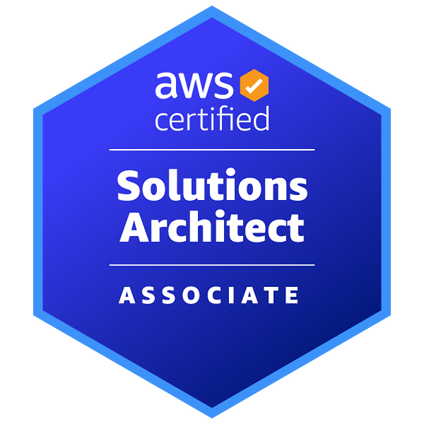
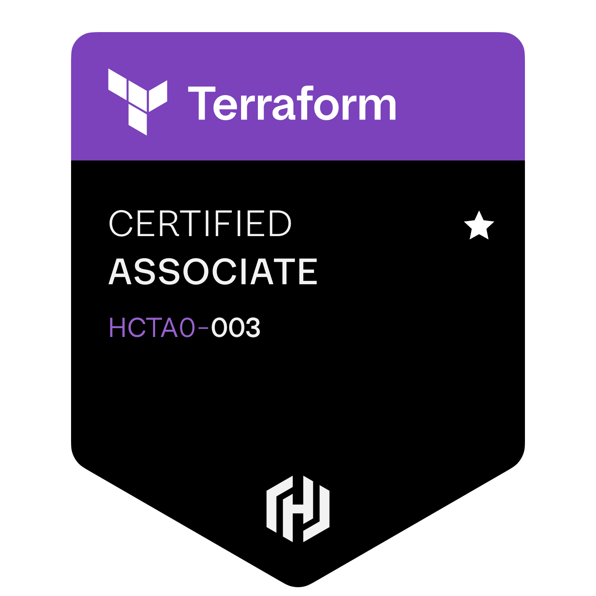
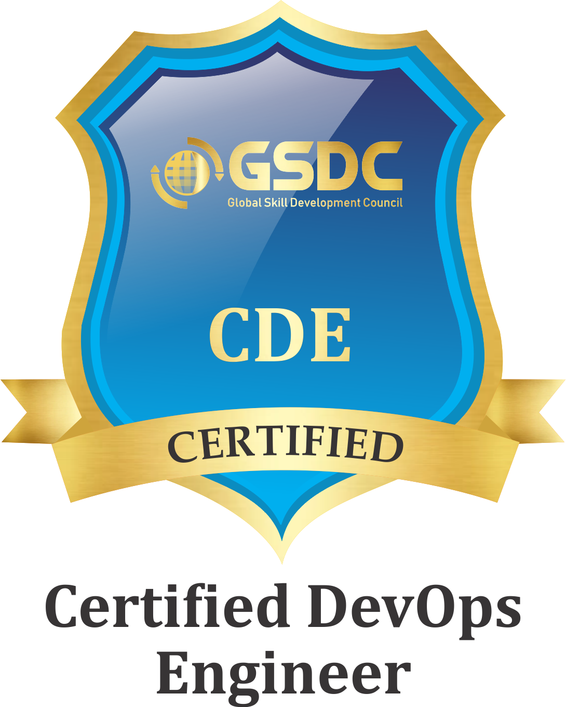

<table>
  <tr>
    <td width="50%" valign="middle" align="left">
      <h2>Hi, I'm Akhil</h2>
      
Senior DevOps Engineer at <strong>Future Secure AI</strong> · Austin, TX

      
I build reliable cloud infrastructure and the platforms that agentic AI systems run on.

      

        
        
        
        
      

    </td>
    <td width="50%" valign="middle" align="right">
      
    </td>
  </tr>
</table>

### Currently

- Running cloud infrastructure and delivery pipelines at Future Secure AI
- Contributing to [google/adk-js](https://github.com/google/adk-js), Google's Agent Development Kit for TypeScript
- Building agent tooling with Claude Code and MCP servers
- Writing about infrastructure and local LLMs at [blog.adwibha.me](https://blog.adwibha.me)

### Toolbox

 

### Certifications

### Open Source

<table>
  <tr>
    <td width="50%" valign="top">
      <a href="https://github.com/adwibha/researchflow-agent"><strong>researchflow-agent</strong></a> 
      Multi-agent research system with LangGraph orchestration and iterative refinement.
    </td>
    <td width="50%" valign="top">
      <a href="https://github.com/adwibha/llm-router"><strong>llm-router</strong></a> 
      Routes each prompt to the cheapest capable model. Per-request cost telemetry, OpenAI-compatible API.
    </td>
  </tr>
  <tr>
    <td width="50%" valign="top">
      <a href="https://github.com/adwibha/obs-stack-local"><strong>obs-stack-local</strong></a> 
      Prometheus and Grafana stack with SLI/SLO alerting. One <code>docker compose up</code>.
    </td>
    <td width="50%" valign="top">
      <a href="https://github.com/adwibha/exploring-adk"><strong>exploring-adk</strong></a> 
      10-module hands-on curriculum for Google's Agent Development Kit.
    </td>
  </tr>
  <tr>
    <td width="50%" valign="top">
      <a href="https://github.com/adwibha/rag-pipeline-ollama"><strong>rag-pipeline-ollama</strong></a> 
      pgvector RAG with Redis caching and local Ollama inference.
    </td>
    <td width="50%" valign="top">
      <a href="https://github.com/adwibha/rag-agentic-search"><strong>rag-agentic-search</strong></a> 
      Agent-driven RAG with iterative query refinement.
    </td>
  </tr>
</table>

### Writing

- [How to Run Open-Source LLMs Locally with Ollama](https://medium.com/@adwibha/how-to-run-open-source-llms-locally-with-ollama-the-fastest-way-to-start-97b9b2f6986d)
- [Monitoring AWS EKS with Prometheus and Grafana](https://medium.com/@adwibha/monitoring-aws-eks-with-prometheus-and-grafana-1b9d92f63a22)
- [Infrastructure as Code with Terraform on AWS](https://medium.com/@adwibha/infrastructure-as-code-iac-with-terraform-on-aws-the-what-why-how-800a99ad24ba)

More on [Medium](https://medium.com/@adwibha) and [blog.adwibha.me](https://blog.adwibha.me).

 
<picture>
  <source media="(prefers-color-scheme: dark)" srcset="https://raw.githubusercontent.com/adwibha/adwibha/output/github-contribution-grid-snake-dark.svg" />
  <source media="(prefers-color-scheme: light)" srcset="https://raw.githubusercontent.com/adwibha/adwibha/output/github-contribution-grid-snake.svg" />
  
</picture>

